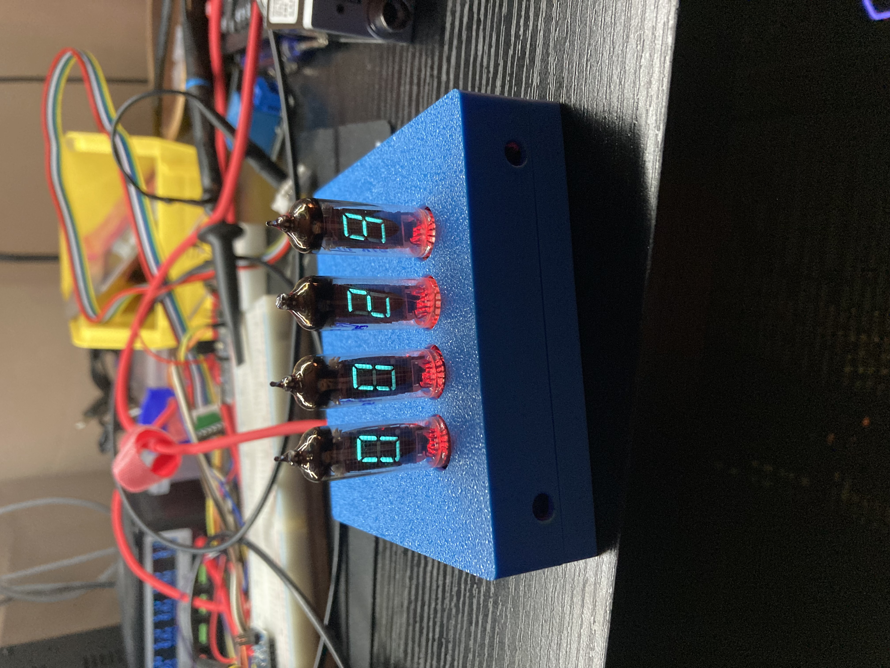

# P1090 - IV-8 Driver, 4x
\> PCBs (both), Rev 1
\> Firmware, Rev 1A (wip)
\> Enclosure, Rev 1

This project is a driver for 4xIV-8 VFD Tubes.

# Directory Structure
- E1091: PCB, Driver board, KiCAD
- E1092: PCB, IV-8 Adapter Board, KiCAD
- F1093: Firmware, Arduino-IDE
- C1094-5: Enclosure, FreeCAD
    - C1094: Bottom Enclosure
    - C1095: Top Enclosure
- `release`: Latest exported build files, includes Schematic, BOM, Gerber, and STL files

# Firmware Doc

The document for the firmware can be found over at [https://electro707.com/documentation/Projects/F1093_docs/](https://electro707.com/documentation/Projects/F1093_docs/)
    

# Known Issues
- The op-amp chosen cannot drive all 4 filaments of the IV-8 VFD tubes
    - ^ Temporary fix is to connect the side of the potentiometer going to the op-amp to 5v directly. The op-amp then (coincidentally) current-limits the output when the pot is at it's minimum position, enough to light up the tubes.
    - Long-term fix is to spec out a different op-amp, which I will test
- The buttons I soldered doesn't reach out of the enclosure

# todo:
- Buy or 3D print light-pipes for better LED-to-IV8 conductance
- Test out better op-amp for filament driver

# License
This project is licensed under [GPLv3](LICENSE.md)**

** This excludes the files in `E1091_PCB_Driver/ExternalStep`, as they came from the manufacturere
