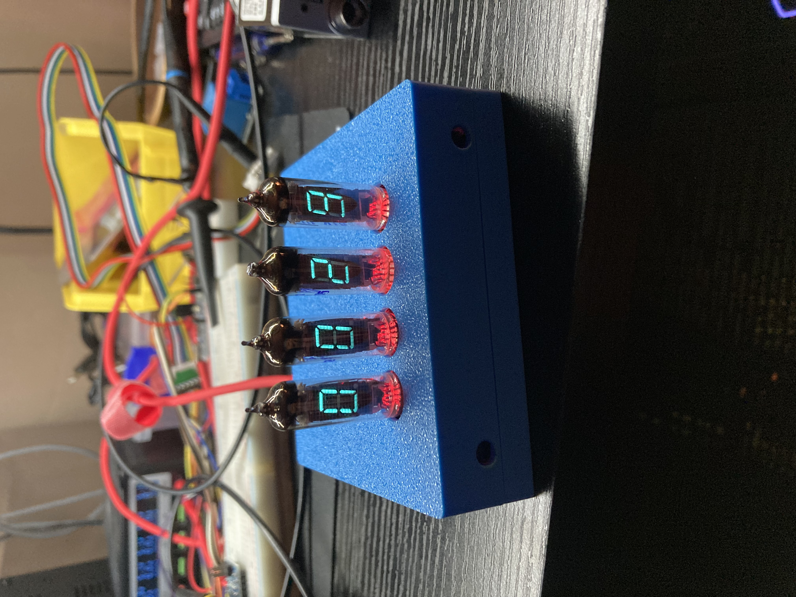

# P1090 - IV-8 Driver, 4x
\> PCBs (both), Rev 1
\> Firmware, Rev 1A (wip)
\> Enclosure, Rev 1

This project is a driver for 4xIV-8 VFD Tubes.

# Directory Structure
- E1091: PCB, Driver board, KiCAD
- E1092: PCB, IV-8 Adapter Board, KiCAD
- F1093: Firmware, Arduino-IDE
- CAD: Enclosure, FreeCAD. All parts are under `C1094.FCStd`
    - C1094: Bottom Enclosure
    - C1095: Top Enclosure
    - C1096: Button Press Extender
    - C1097: Light Pipe for LED
- `release`: Latest exported build files, includes Schematic, BOM, Gerber, and STL files

# Firmware Doc

The document for the firmware can be found over at [https://electro707.com/documentation/Projects/F1093_docs/](https://electro707.com/documentation/Projects/F1093_docs/)

The document also describes the requirements for building the Firmware through the Arduino IDE.

# Known Issues
> [!IMPORTANT]
> Please read the file linked below before attempting to build this hardware.

Known issues, and any workarounds, are documented in [ERRATA.md](ERRATA.md).

# todo:
- Buy or 3D print light-pipes for better LED-to-IV8 conductance

# License
This project is licensed under [GPLv3](LICENSE.md)**

** This excludes the files in `E1091_PCB_Driver/ExternalStep`, as they came from the manufacturer.
